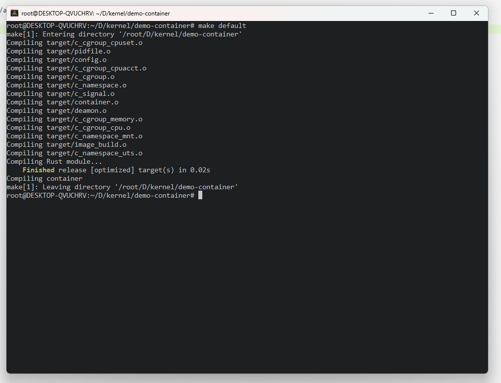
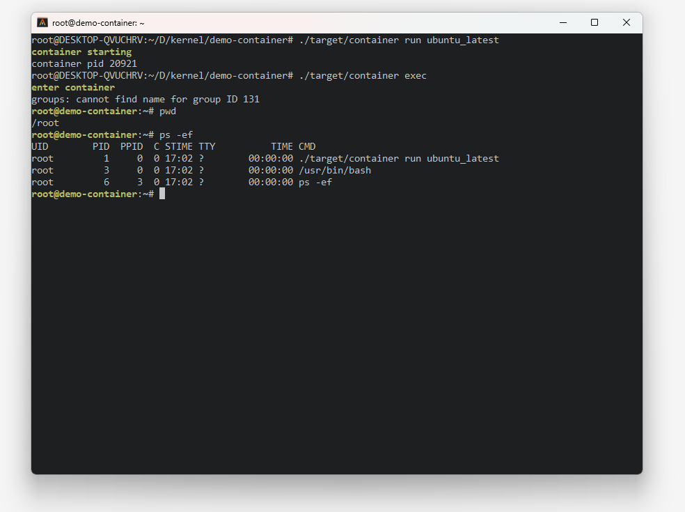
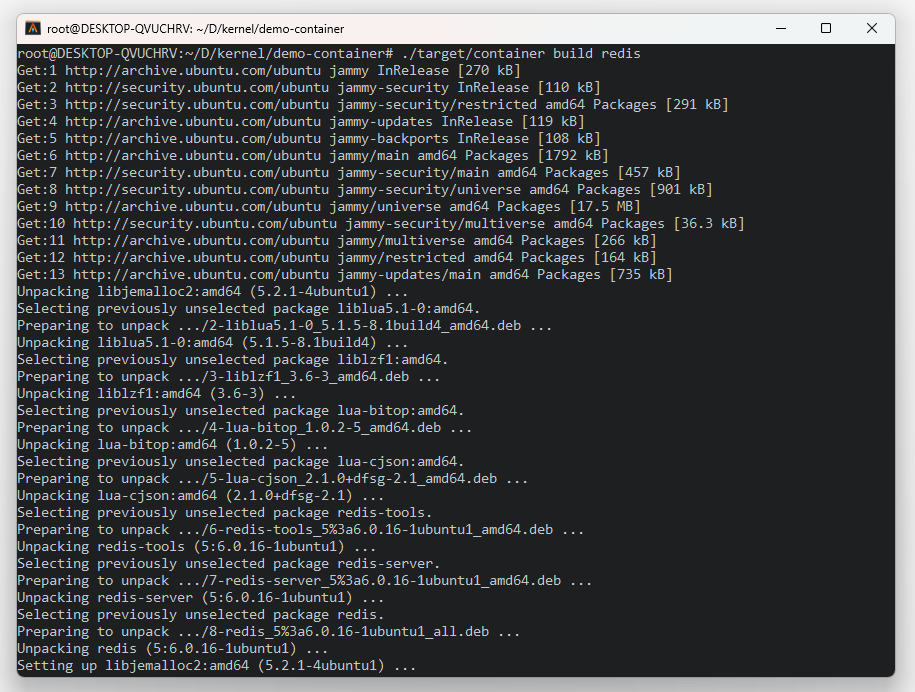
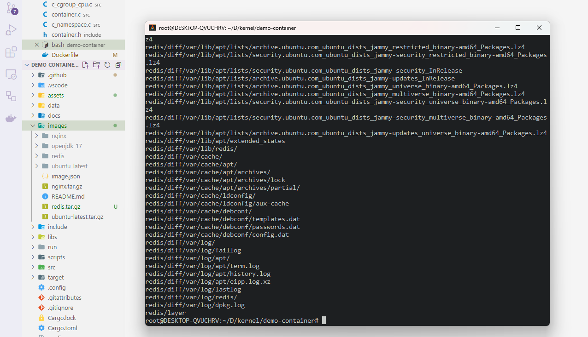
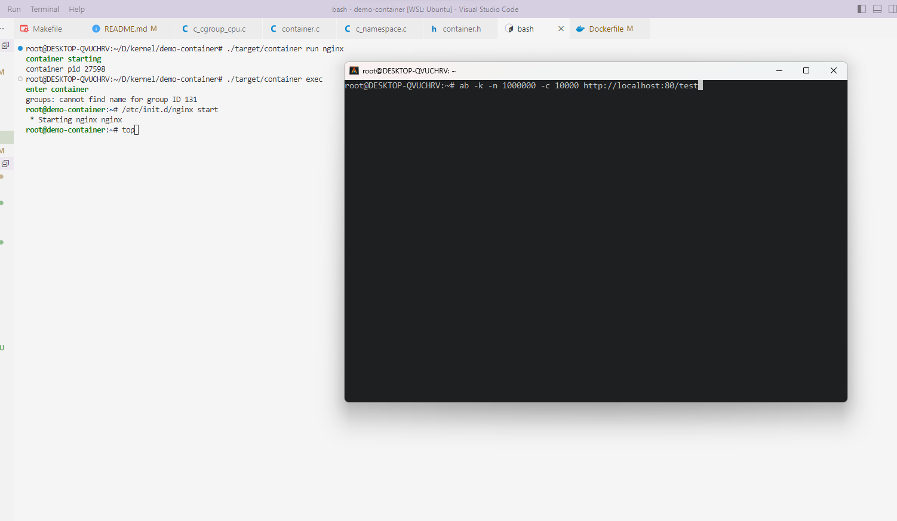
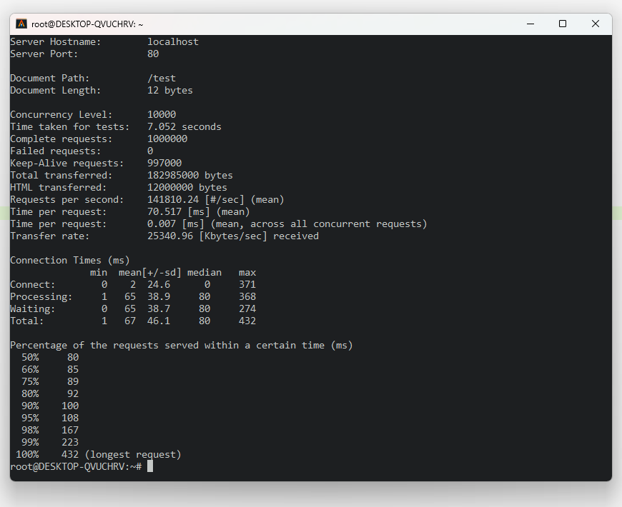
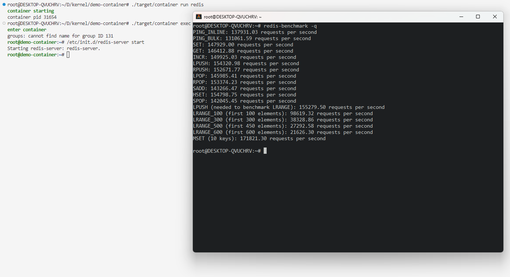

<h1 align = "center">Container</h1>
<div align = "center">
    <a href="LICENSE.md">
        
        
    </a>
</div>

<hr/>

基于 Namespace, Cgroup 及 OverlayFS 的轻量级高性能 Linux 容器 

https://github.com/JCKeep/container/assets/75779357/708ad6f6-b090-4bb9-ab72-270c374f4835

## **TO IMPLEMENT**

- [x] 实现 make exec 进入容器 bash
- [x] 使用 OverlayFS 实现文件系统分层，让多个容器安全共享
- [x] 增加配置文件支持
- [x] 重构 cgroup 模块
- [x] 初步添加 Rust 支持
- [x] 使用 OverlayFS 文件系统支持容器镜像
- [x] 实现镜像打包功能
- [x] 重构 namespace 模块 
- [ ] 增加新的配置文件支持
- [ ] 实现容器运行时（可参考crun）负责启动和管理容器的生命周期
- [ ] 兼容 OCI 容器标准
- [ ] 加入 user_namespace 保户主机文件安全 (目前我的 WSL 未开启 userns)
- [ ] 增加 net_namespace 支持 
- [ ] 编写 namespace 内核源码文档
- [ ] 编写 cgroup 内核源码实现文档
- [ ] bridge 网络模式
- [ ] container 网络模式
- [ ] 部分复杂功能使用 Rust 重构
- [ ] **. . .**

## 如何使用

### 编译

```shell
$ make default
```



`make default` 会使用 `CONFIG_OVERLAY` 与 `CONFIG_IMAGE` 两个编译选项用来启用 OverlayFS 文件系统分层叠加和容器镜像的支持，需一起使用。

### 运行容器

```shell
$ ./target/container run [image]
```

`image` 为镜像名称，镜像位于 `images` 目录下，可使用已有镜像。

例：



也可使用自己编写 `Dockerfile` 指定基础镜像，并根据需求打包新的镜像。

例：基于 `ubuntu-latest` 构建 `redis` 镜像

```dockerfile
FROM ubuntu_latest

RUN /usr/bin/apt update

RUN /usr/bin/apt install -y redis
```

使用 `container build [new image]` 进行镜像打包。





然后我们就得到了一个新的镜像，新镜像位于目录 `images` 下，**所打包的镜像仅仅为最顶层镜像，因为底层镜像是共享的，采取镜像分层以减小镜像体积**。

### 进入容器

```shell
$ ./target/container exec
```


这样我们就得到了一个运行在一个新的容器中的 bash，这个容器与主机资源相互隔离，其资源限制可以在 `container.json` 文件中进行自定义配置。默认将采用 1 核 CPU，64M 虚拟内存，1M 栈空间，5% cpu使用上线，未来将加入更多特性。

配置文件：

```json
{
    "cgroup": {
        "cpu": {
            "shares": 2048,
            "cfs_limit": 0.90,
            "rt_limit": 0.80
        },
        "cpuset": {
            "cpus": "4-5",
            "load_balance": 1,
            "cpu_exclusive": 1
        },
        "memory": {
            "memory_limit": "128M",
            "tcp_kmemory_limit": "64G"
        },
        "cpuacct": {
            "enable": 1
        }
    },
    "image": {
		
    },
    "mount": {
		
    },
    "net": {
		
    }
}
```

### 退出容器

容器为后台守护进程运行，若要停止运行，可以使用一下命令关闭守护进程。

```shell
$ ./target/container exit
```


## 容器镜像性能测试

该测试仅仅为了验证在容器中运行并不损失性能。

### nginx 镜像并发测试

容器配置如下：

```json
{
    "cgroup": {
        "cpu": {
            "shares": 2048,
            "cfs_limit": 0.90,
            "rt_limit": 0.80
        },
        "cpuset": {
            "cpus": "4-5",
            "load_balance": 0,
            "cpu_exclusive": 1
        },
        "memory": {
            "memory_limit": "128M",
            "tcp_kmemory_limit": "64G"
        },
        "cpuacct": {
            "enable": 1
        }
    },
    "image": {

    },
    "mount": {

    },
    "net": {

    }
}
```

nginx 镜像配置： 128M 虚拟内存，独占 4 - 5 两个 cpu，并且禁止 cpu 负载均衡，并且为其限制最大 90% 的 cpu 使用上限 (仅仅可以使用 4-5 两个 cpu 的 90%，剩下 10% cpu 留给 top 命令及时监控 nginx)。

测试命令：

```shell
ab -k -n 1000000 -c 10000 http://localhost:80/test
```





双核，1000000个请求，10000并发量，**每秒处理请求数（QPS）为 141810**，综合多次测试，每秒请求数在13万至15万间波动，平均 QPS 14万。

### redis 镜像并发测试

配置同上，但仅使用 1核 cpu。



QPS 平均在 14 万左右。

