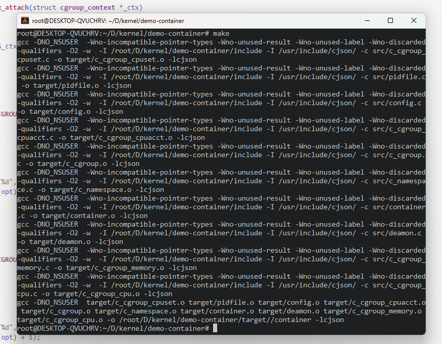
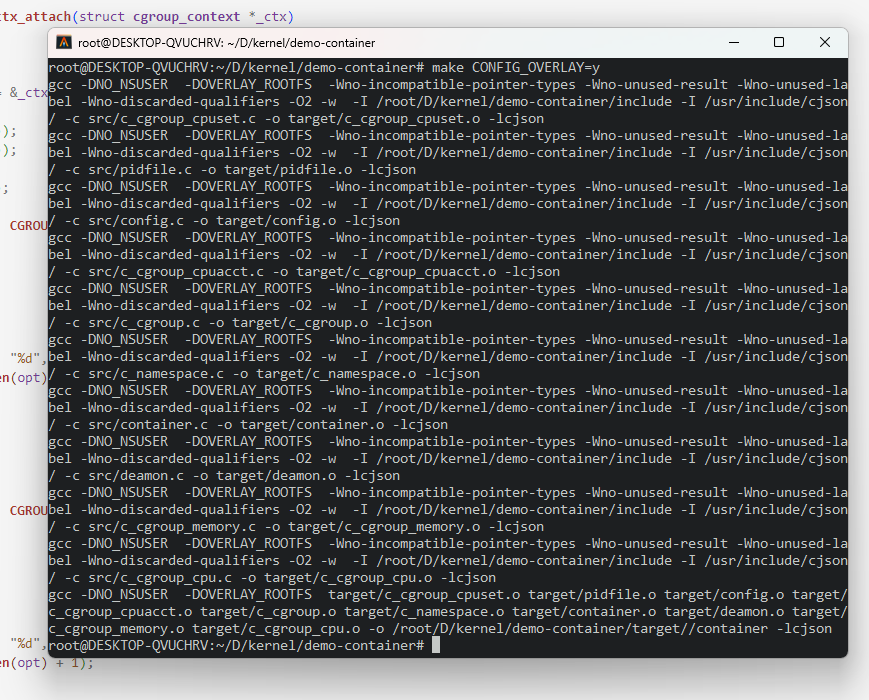
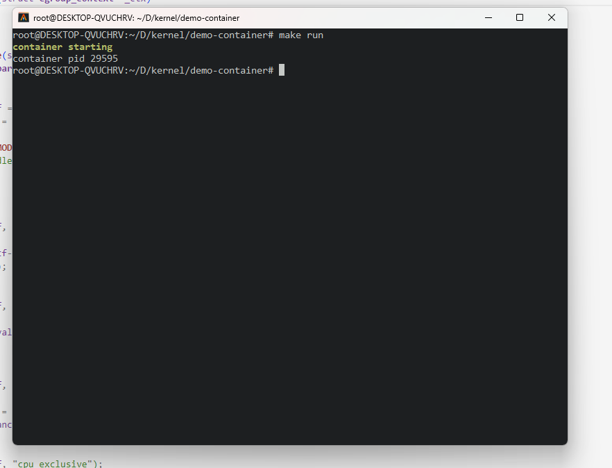

# CONTAINER

一个基于 Linux Namespace & Cgroup 的简易容器

## 如何使用

1. 编译

    ```shell
    $ make
    ```

    

    若要使用`Overlay FS`提供的文件系统分层及写时拷贝以保护主机文件系统安全及多容器共享文件系统，则可使用 `overlay` 选项进行编译

    ```shell
    $ make CONFIG_OVERLAY=y
    ```

    

2. 运行容器

    ```shell
    $ make run
    ```

    

3. 进入容器

    ```shell
    $ make exec
    ```

    

这样我们就得到了一个运行在一个新的容器中的bash，这个容器与主机资源相互隔离，可以在`include/c_cgroup.h`中对容器资源进行限制，默认为 `cpu: 10%, memory: 64M, cpuset: 0-1, stack: 32K`，未来将增加配置文件支持，像Dockerfile及docker-compose.yml一样对容器进行定制化配置。

4. 退出容器

   ```shell
   $ make exit
   ```

## 配置文件 container.json

```json
{
    "cgroup": {
        "cpu": {
            "shares": 128,
            "cfs_limit": 0.05,
            "rt_limit": 0.80
        },
        "cpuset": {
            "cpus": "0-1,4",
            "load_balance": 0,
            "cpu_exclusive": 1
        },
        "memory": {
            "memory_limit": "64M",
            "tcp_kmemory_limit": "1G"
        },
        "cpuacct": {
            "enable": 1
        }
    },
    "namespace": {

    },
    "test": "Hello World!\n"
}
```


## 待实现

- [x] 实现 make exec 进入容器 bash
- [x] 使用 OverlayFS 实现文件系统分层，让多个容器安全共享
- [x] 增加配置文件支持
- [x] 重构 namespace 模块
- [ ] 实现一个容器最小文件系统
- [ ] 加入 user_namespace 保户主机文件安全 (目前我的WSL未开启userns，暂时跳过)
- [ ] 增加 net_namespace 支持 (Linux net 子系统过于复杂，将在7月份开始学习)
- [ ] 支持多个容器，实现管理多个容器的用户命令
- [ ] 使用 OverlayFS 文件系统支持容器镜像
- [ ] namespace 内核源码实现解析
- [ ] cgroup 内核源码实现解析
- [x] 重构 cgroup 模块 
- [ ] **. . .**


