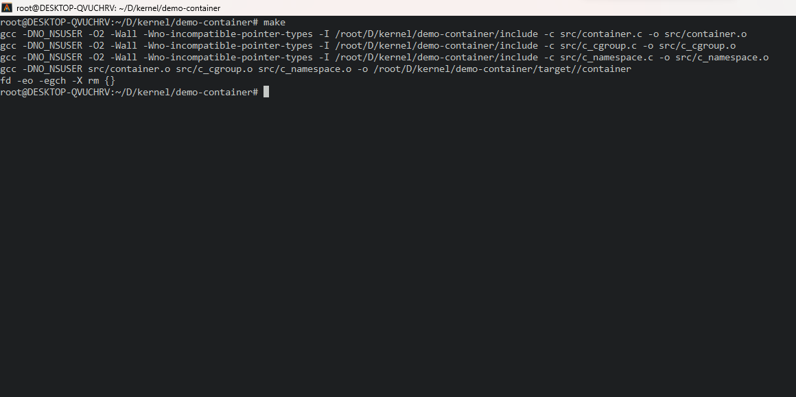
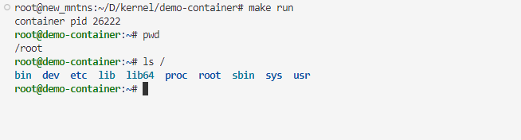

# DEMO_CONTAINER

一个基于 Linux Namespace & Cgroup 的简易容器

## 如何使用

1. 编译

    ```shell
    make
    ```

    

2. 运行

    ```shell
    make run
    ```

        

这样我们就得到了一个运行在一个新的容器中的bash，这个容器与主机资源相互隔离，可以在`include/c_cgroup.h`中对容器资源进行限制，默认为 `cpu: 30%, memory: 128M, cpuset: 0-1, stack: 2M`
