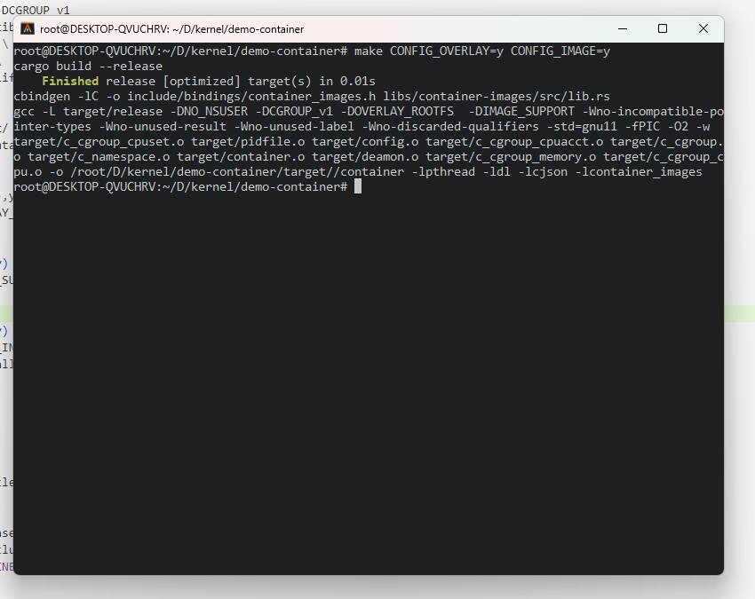
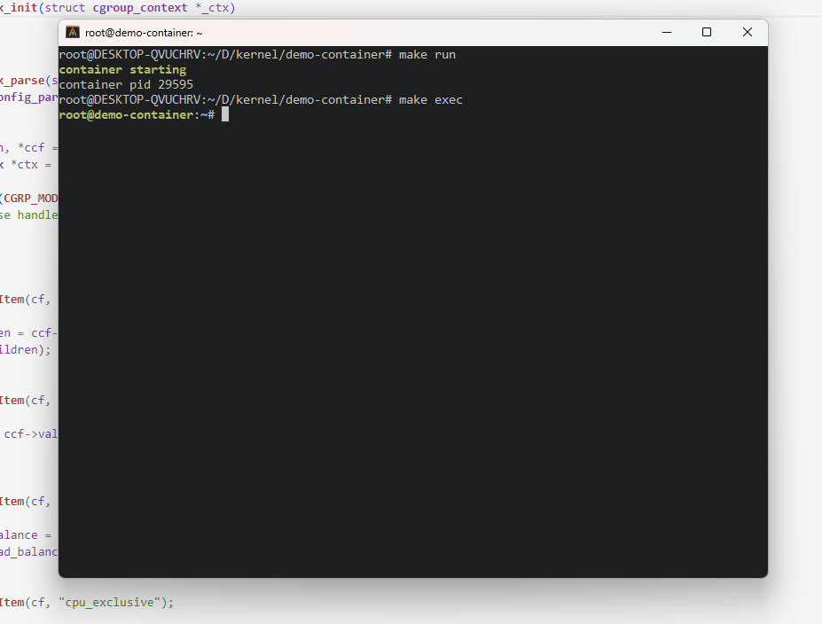

# CONTAINER

一个基于 Namespace, Cgroup 及 OverlayFS 的轻量级 Linux 容器 

## 如何使用

[](./assets/container.mp4)

1. 编译

    ```shell
    $ make CONFIG_OVERLAY=y CONFIG_IMAGE=y
    ```

    

    `CONFIG_OVERLAY`与`CONFIG_IMAGE`编译选项用来编译时启用OverlayFS及镜像支持，需一起使用。

2. 运行容器

    ```shell
    $ ./target/container run [image]
    ```

    `image`为镜像名称，镜像位于`images`目录下，可使用已有镜像，也可使用`container build [image]`自己编写`Dockerfile`构建镜像。

    例：基于`ubuntu`构建`redis`镜像

    ```dockerfile
    FROM ubuntu_latest
    
    RUN /usr/bin/apt update
    
    RUN /usr/bin/apt install -y redis
    ```

3. 进入容器

    ```shell
    $ make exec
    ```

    

这样我们就得到了一个运行在一个新的容器中的bash，这个容器与主机资源相互隔离，可以在`include/c_cgroup.h`中对容器资源进行限制，默认为 `cpu: 10%, memory: 64M, cpuset: 0-1, stack: 32K`，未来将增加配置文件支持，像Dockerfile及docker-compose.yml一样对容器进行定制化配置。

4. 退出容器

   ```shell
   $ make exit
   ```

## 配置文件 container.json

```json
{
    "cgroup": {
        "cpu": {
            "shares": 128,
            "cfs_limit": 0.05,
            "rt_limit": 0.80
        },
        "cpuset": {
            "cpus": "0-1,4",
            "load_balance": 0,
            "cpu_exclusive": 1
        },
        "memory": {
            "memory_limit": "64M",
            "tcp_kmemory_limit": "1G"
        },
        "cpuacct": {
            "enable": 1
        }
    },
    "namespace": {

    },
    "test": "Hello World!\n"
}
```


## 待实现

- [x] 实现 make exec 进入容器 bash
- [x] 使用 OverlayFS 实现文件系统分层，让多个容器安全共享
- [x] 增加配置文件支持
- [x] 重构 cgroup 模块
- [x] 初步添加 Rust 支持
- [ ] 重构 namespace 模块 
- [x] 使用 OverlayFS 文件系统支持容器镜像
- [x] 实现镜像打包功能
- [ ] 支持多个容器，实现管理多个容器的用户命令
- [ ] 加入 user_namespace 保户主机文件安全 (目前我的WSL未开启userns，暂时跳过)
- [ ] 增加 net_namespace 支持 (Linux net 子系统将在7月份开始学习)
- [ ] 编写 namespace 内核源码文档
- [ ] 编写 cgroup 内核源码实现文档
- [ ] **. . .**


