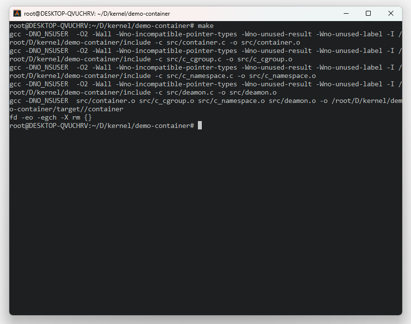
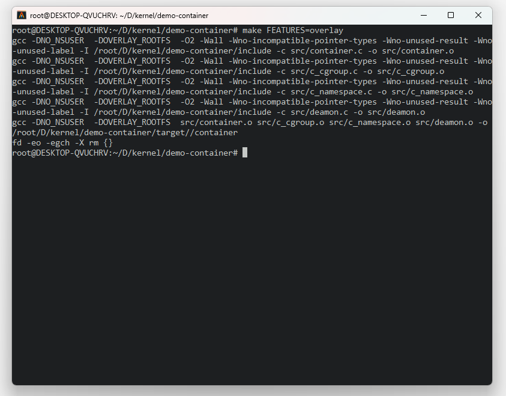
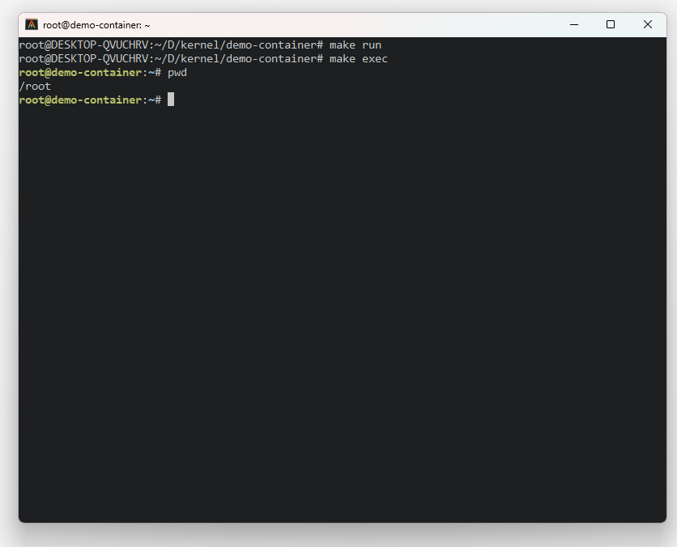

# CONTAINER

一个基于 Linux Namespace & Cgroup 的简易容器

## 如何使用

1. 编译

    ```shell
    $ make
    ```

    

    若要使用`Overlay FS`提供的文件系统分层及写时拷贝以保护主机文件系统安全，则可使用

    ```shell
    make FEATURES=overlay
    ```

    

2. 运行容器

    ```shell
    $ make run
    ```

    当没有任何输出则容器已经开始在后台运行了

3. 进入容器

    ```shell
    $ make exec
    ```

    

这样我们就得到了一个运行在一个新的容器中的bash，这个容器与主机资源相互隔离，可以在`include/c_cgroup.h`中对容器资源进行限制，默认为 `cpu: 10%, memory: 64M, cpuset: 0-1, stack: 32K`，未来将增加配置文件支持，像Dockerfile及docker-compose.yml一样对容器进行定制化配置。

4. 退出容器

   ```shell
   $ make exit
   ```


## TO IMPLEMENT

- [x] 实现 make exec 进入容器 bash
- [x] 使用 OverlayFS 文件系统重新实现 rootfs
- [ ] 增加配置文件支持
- [ ] 重构 namespace 模块
- [ ] 实现一个容器最小文件系统
- [ ] 加入 user_namespace 保户主机文件安全 (目前我的WSL未开启userns，暂时跳过)
- [ ] 增加 net_namespace 支持 (Linux net 子系统过于复杂，将在7月份开始学习)
- [ ] 支持多个容器，实现管理多个容器的用户命令
- [ ] 使用 OverlayFS 文件系统支持容器镜像
- [ ] namespace 内核源码实现解析
- [ ] cgroup 内核源码实现解析
- [ ] 重构 cgroup 模块 (目前规模较小，无需重构)

**. . .**

## 最小文件系统

ME: **能否自己定制一个最小文件系统**

chatGPT: 

> 是的，可以自己定制一个最小文件系统来用于 Linux 容器。
>
> 通常情况下，最小文件系统只需要包含操作系统所需的最小文件和程序即可。一般会选择一个已有的最小文件系统作为基础，然后再从中删除不需要的文件和程序，以减小文件系统的大小。常见的最小文件系统包括 BusyBox 和 Alpine Linux。
>
> 如果需要自己定制最小文件系统，可以采用 BusyBox 来构建。BusyBox 是一个开源的工具集，其中包含了许多用于构建最小文件系统的工具，例如 init、sh、ls、cat、cp、mkdir 等。可以使用 BusyBox 来构建最小文件系统，并自定义所需的文件和程序。

ME: **怎么用BusyBox构建一个最小文件系统**

charGPT:

> 可以使用 BusyBox 工具来构建一个最小文件系统。BusyBox 是一个单一的可执行文件，包含了许多常用的 UNIX 工具，如 ls、cp、mv、rm、sed、awk、sh 等。
>
> 以下是构建最小文件系统的步骤：
>
> 1. 下载 BusyBox 工具：
>
> ```shell
> $ wget https://busybox.net/downloads/busybox-1.33.0.tar.bz2
> ```
>
> 2. 解压 BusyBox：
>
> ```shell
> $ tar xjf busybox-1.33.0.tar.bz2
> ```
>
> 3. 进入 BusyBox 目录，进行配置：
>
> ```shell
> $ cd busybox-1.33.0/
> $ make defconfig
> ```
>
> 运行 `make defconfig` 命令将使用默认配置文件进行配置。也可以运行 `make menuconfig` 命令自定义配置文件。
>
> 4. 编译 BusyBox：
>
> ```shell
> $ make
> ```
>
> 编译完成后，会生成一个 `busybox` 可执行文件。
>
> 5. 创建最小文件系统目录：
>
> ```shell
> $ mkdir rootfs
> $ cd rootfs
> $ mkdir -p bin etc proc sys dev
> ```
>
> 在 `rootfs` 目录下创建 `bin`、`etc`、`proc`、`sys` 和 `dev` 目录。
>
> 6. 复制 BusyBox 可执行文件到 `bin` 目录：
>
> ```shell
> $ cp ../busybox bin/
> ```
>
> 复制完成后，`bin` 目录下会有一个名为 `busybox` 的可执行文件。
>
> 7. 创建设备节点：
>
> ```shell
> $ cd dev
> $ sudo mknod console c 5 1
> ```
>
> 创建一个名为 `console` 的设备节点。
>
> 8. 创建 `etc` 目录下的文件：
>
> ```shell
> $ cd ../etc
> $ touch passwd
> $ echo "root:x:0:0:root:/root:/bin/sh" > passwd
> ```
>
> 创建一个名为 `passwd` 的文件，并写入 `root` 用户的信息。
>
> 9. 在 `proc` 和 `sys` 目录下创建挂载点：
>
> ```shell
> $ cd ../
> $ sudo mount -t proc none proc/
> $ sudo mount -t sysfs none sys/
> ```
>
> 挂载 `proc` 和 `sys` 文件系统到 `rootfs/proc` 和 `rootfs/sys` 目录下。
>
> 现在，最小文件系统就已经创建完成了。可以使用 `chroot` 命令切换到 `rootfs` 目录下，然后执行 `./bin/busybox sh` 命令启动最小文件系统。
>
> 在BusyBox创建的最小文件系统中，只会包含最基本的系统工具和必要的文件，没有链接库和其他依赖。因此，如果你需要运行的应用程序依赖于库，你需要手动将它们添加到文件系统中。一种方法是将依赖项静态链接到应用程序中，另一种方法是将依赖项动态链接并将库一同打包到文件系统中。
>
> 是的，一般情况下最小文件系统不会包含bash，而是包含一个更加轻量的shell，比如Alpine Linux默认的shell是ash。因此，启动容器后进入最小文件系统，使用的命令行解释器一般是sh，而不是bash。


