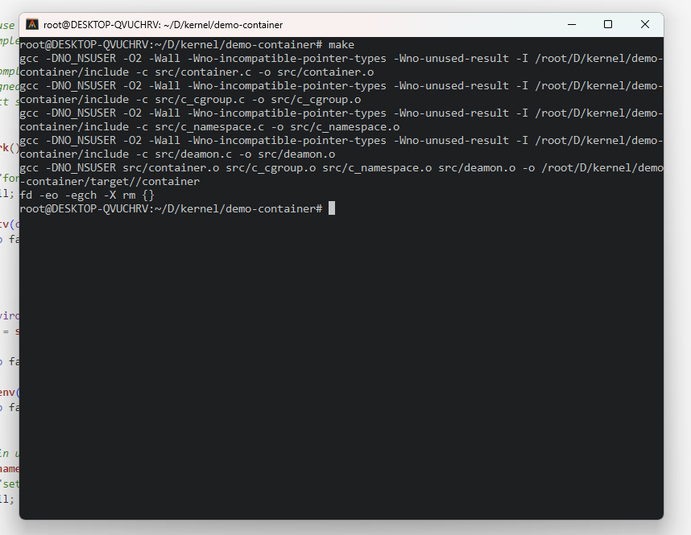
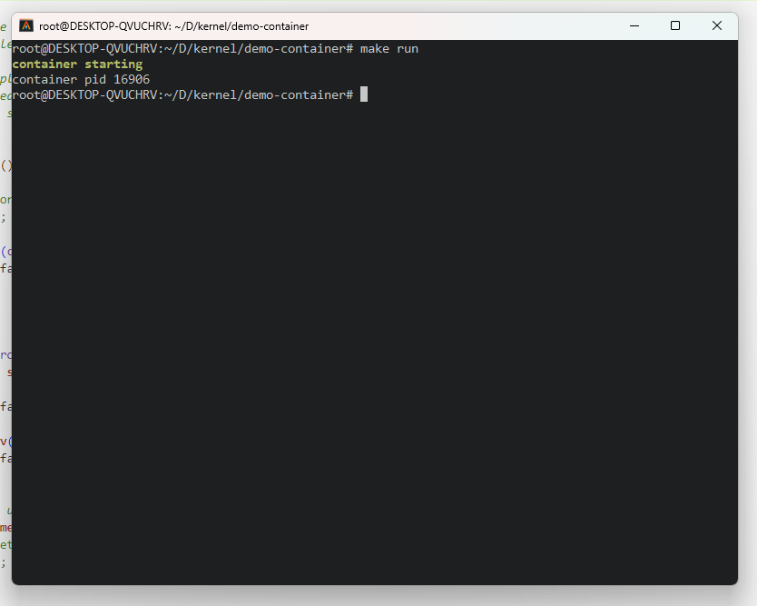
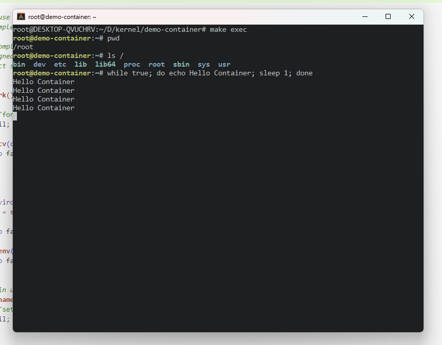

# CONTAINER

一个基于 Linux Namespace & Cgroup 的简易容器

## 如何使用

1. 编译

    ```
    make
    ```

    

2. 运行容器

    ```
    make run
    ```

    

    当输出`container starting`是代表容器已经开始在后台运行了

3. 进入容器

    ```
    make exec
    ```

    

这样我们就得到了一个运行在一个新的容器中的bash，这个容器与主机资源相互隔离，可以在`include/c_cgroup.h`中对容器资源进行限制，默认为 `cpu: 10%, memory: 64M, cpuset: 0-1, stack: 32K`，未来将增加配置文件支持，像Dockerfile及docker-compose.yml一样对容器进行定制化配置。


## TO IMPLEMENT

- [x] 实现 make exec 进入容器 bash
- [ ] 重构 cgroup 模块
- [ ] 加入 user_namespace 保户主机文件安全
- [ ] 增加 net_namespace 支持
- [ ] 增加配置文件支持
- [ ] 支持多个容器，实现管理多个容器的用户命令
- [ ] namespace 内核源码实现解析
- [ ] cgroup 内核源码实现解析

**. . .**
